# Franz UI Navigation State Machine

Dieses Dokument beschreibt die komplette UI-Navigation als Mermaid-Diagramme:
- alle Haupt-Screens,
- Fokuswechsel,
- Dialog-Öffnungen,
- Dialog-interne Key-Transitions,
- Skills-Manager-Fokusmodell (Input/Actions/List) zur Vermeidung von Focus-Traps.

Stand: Codebasis in `internal/ui/model/ui.go`, `internal/ui/model/keys.go`, `internal/ui/dialog/*`.

Normativer Fokus-Standard fuer alle aktuellen und zukuenftigen Screens:
`docs/focus-standard.md`.

## 0) Vollständige Screen-/Overlay-Inventarliste

```mermaid
flowchart TD
    App[Franz TUI] --> CoreScreens
    App --> GlobalLayers
    App --> Dialogs

    CoreScreens --> Onboarding[Onboarding Screen]
    CoreScreens --> Initialize[Initialize Screen]
    CoreScreens --> Landing[Landing Screen]
    CoreScreens --> ChatWide[Chat Screen Wide]
    CoreScreens --> ChatCompact[Chat Screen Compact]
    ChatCompact --> SessionDetailsOverlay[Compact Session Details Overlay]

    GlobalLayers --> Header[Header]
    GlobalLayers --> StatusBar[Status/Help Bar]
    GlobalLayers --> CompletionsPopup[@-Completions Popup]
    GlobalLayers --> EditorAttachments[Editor Attachments Row]

    Dialogs --> CommandsDlg[Commands Dialog]
    Dialogs --> ModelsDlg[Models Dialog]
    Dialogs --> SessionsDlg[Sessions Dialog]
    Dialogs --> ReasoningDlg[Reasoning Dialog]
    Dialogs --> SkillsDlg[Skills Manager Dialog]
    Dialogs --> FilePickerDlg[File Picker Dialog]
    Dialogs --> PermissionsDlg[Permissions Dialog]
    Dialogs --> OAuthDlg[OAuth Dialogs]
    Dialogs --> ApiKeyDlg[API Key Input Dialog]
    Dialogs --> QuitDlg[Quit Confirm Dialog]
    Dialogs --> ArgumentsDlg[Arguments Dialog]
```

## 0.1) Render-Komposition pro Hauptscreen

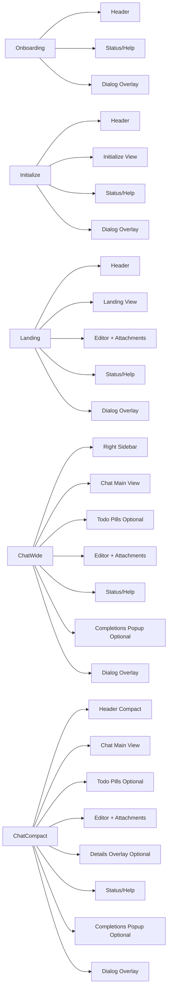

## 1) App-Level State Machine (Screens + Globale Shortcuts)

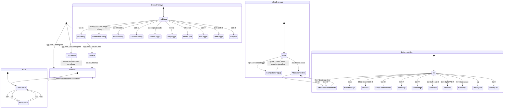

## 1.1) Vollständiger Dialog-Öffnungsgraph

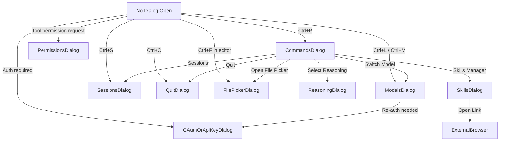

## 2) Dialog Routing (welcher Screen öffnet welchen Dialog)

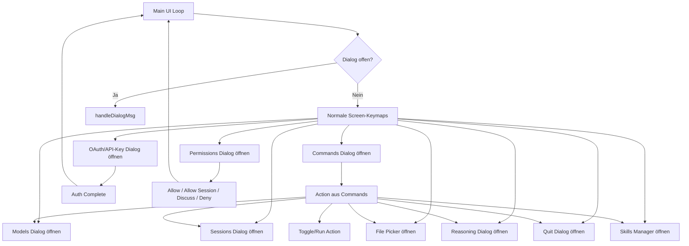

## 3) Commands Dialog (System/User/MCP)

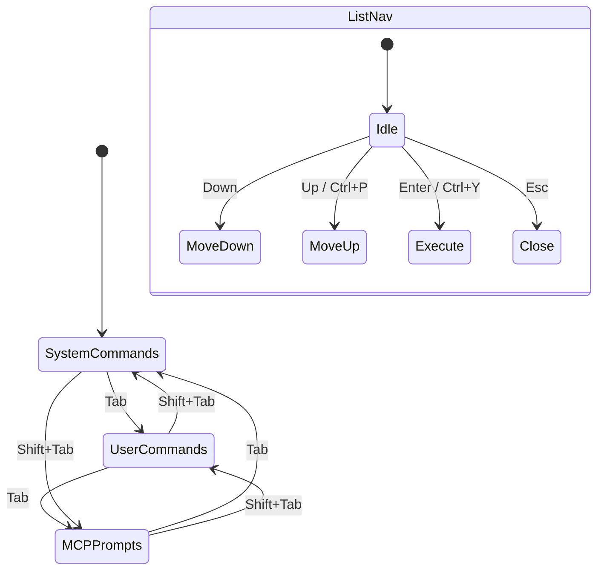

## 4) Models Dialog

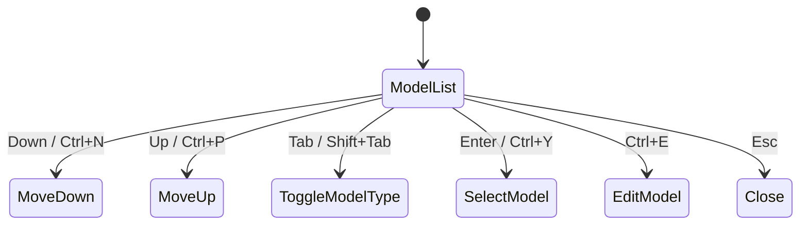

## 5) Sessions Dialog

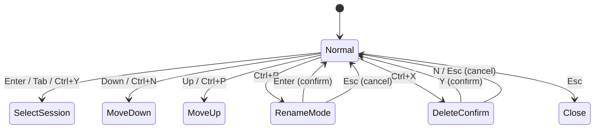

## 6) Skills Manager (Wichtig gegen Focus-Traps)

### 6.1 Top-Level Layout/Fokus

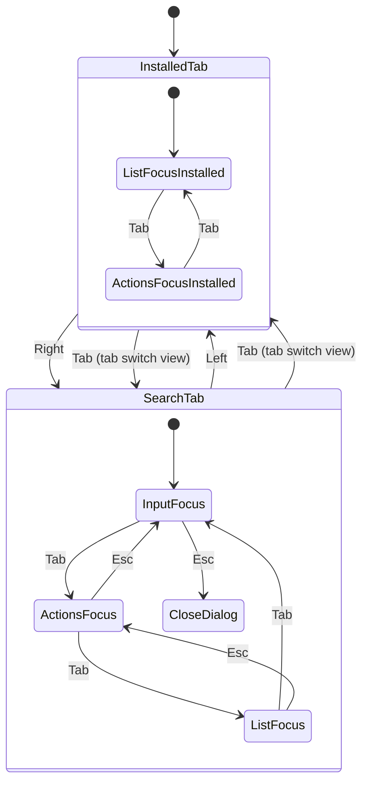

### 6.2 Search Tab Key-Transitions

```mermaid
stateDiagram-v2
    [*] --> InputFocus

    state InputFocus {
        [*] --> Typing
        Typing --> DebouncedSearch: any char incl. space
        Typing --> ClearInput: Ctrl+Backspace
        Typing --> ActionsFocus: Tab / Down
        Typing --> InstalledTab: Left
        Typing --> SearchTab: Right
    }

    state ActionsFocus {
        [*] --> ActionSelected
        ActionSelected --> PrevAction: Ctrl+Left
        ActionSelected --> NextAction: Ctrl+Right
        ActionSelected --> RunAction: Enter
        ActionSelected --> ListFocus: Down
        ActionSelected --> InputFocus: Up / Esc
    }

    state ListFocus {
        [*] --> ItemSelected
        ItemSelected --> MoveUp: Up
        ItemSelected --> MoveDown: Down
        ItemSelected --> ToggleMultiSelect: Space
        ItemSelected --> InputFocus: any typing key
        ItemSelected --> ActionsFocus: Esc
    }
```

### 6.3 Installed Tab Key-Transitions

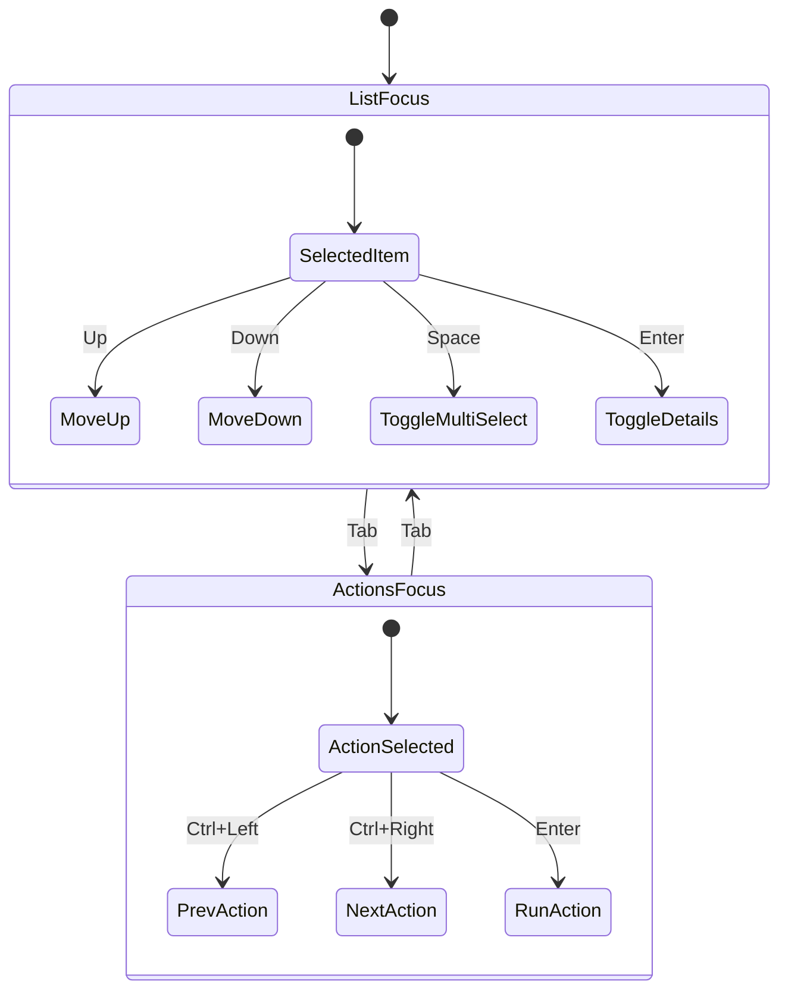

### 6.4 Skills Actions (auf selektierte Items)

```mermaid
flowchart TD
    A[Installed List selected items] --> B{Action}
    B -->|Enable| C[ActionSkillsSetDisabledBatch Disabled=false]
    B -->|Disable| D[ActionSkillsSetDisabledBatch Disabled=true]
    B -->|Fix Perms| E[ActionSkillsFixPerms Names=[]]
    B -->|Delete| F[ActionSkillsDeleteBatch Names=[]]
    B -->|Refresh| G[Reload installed list]
    B -->|Sources| H[Load tracked sources]

    I[Search List selected sources] --> J{Action}
    J -->|Details| K[Toggle details panel]
    J -->|Install| L[Queue install step-by-step]
    J -->|Open Link| M[Open details URL]
    J -->|Refresh| N[Search again]
    J -->|Sources| O[Load tracked sources]
```

## 7) Permissions Dialog (Tool Calls)

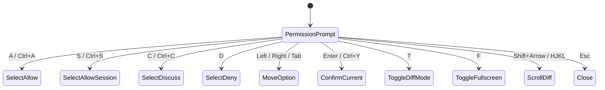

## 8) Quit Dialog

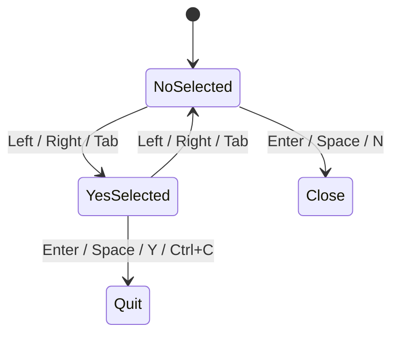

## 9) OAuth / API-Key Dialogs

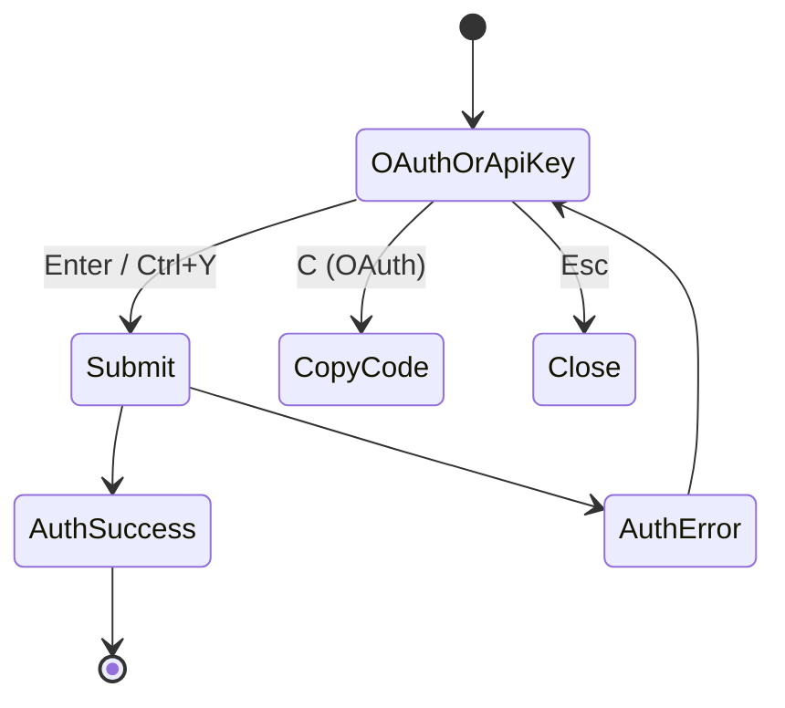

## 10) File Picker Dialog

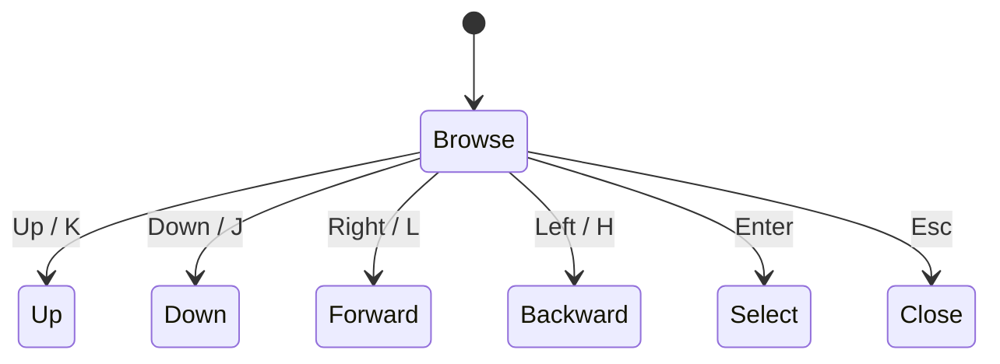

## 10.1) Reasoning Dialog

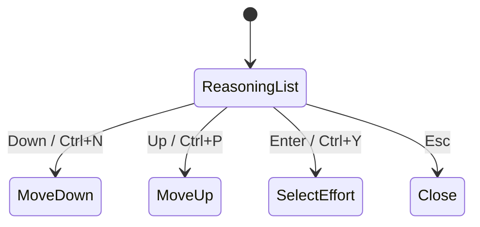

## 10.2) Arguments Dialog

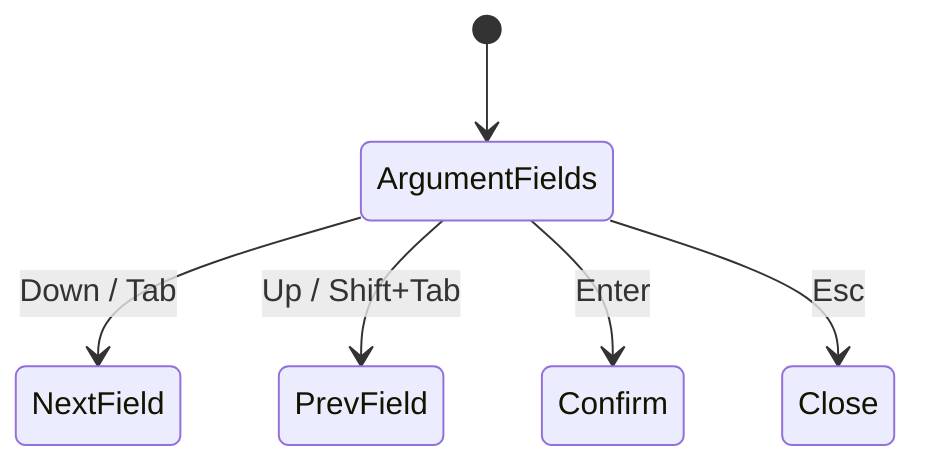

## 11) Sequenzdiagramm: Key Event Routing (zentral)

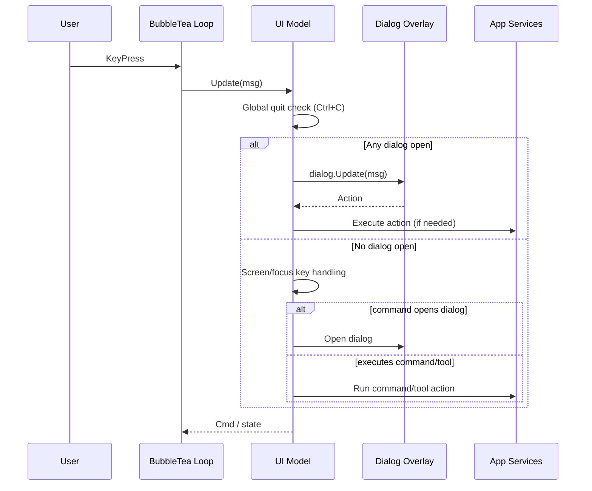

## 12) Regelwerk zur Vermeidung von Focus-Traps (Normativ)

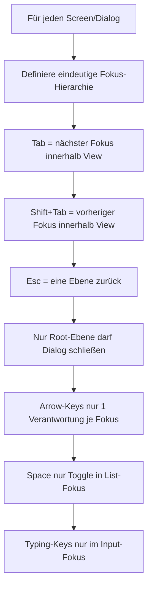

---

Wenn du willst, kann ich als nächsten Schritt aus diesem Diagramm eine
`UI_NAVIGATION_CONTRACT.md` mit testbaren Invarianten machen (z. B. "Esc from
list must never close dialog directly"), damit Focus-Traps per Tests geblockt
werden.
